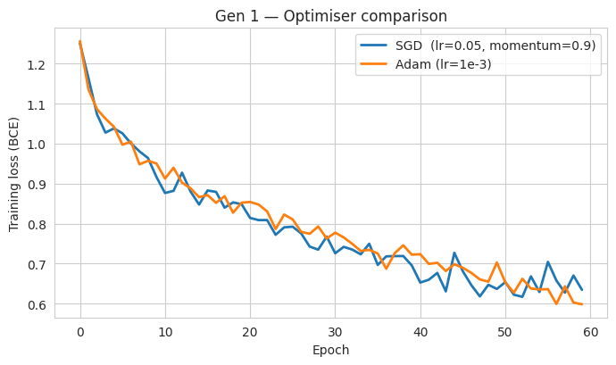
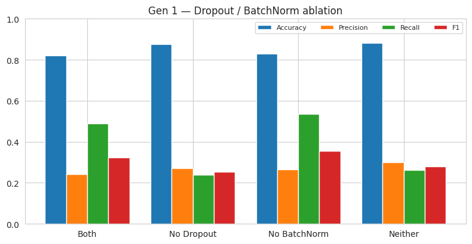
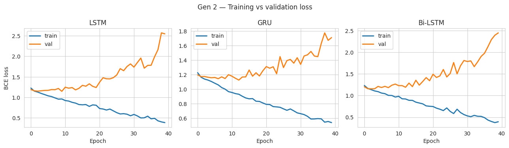
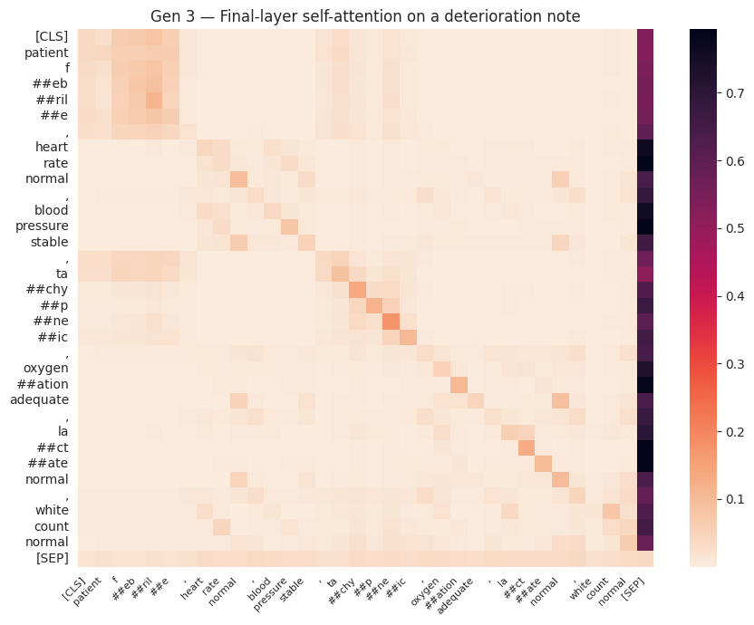
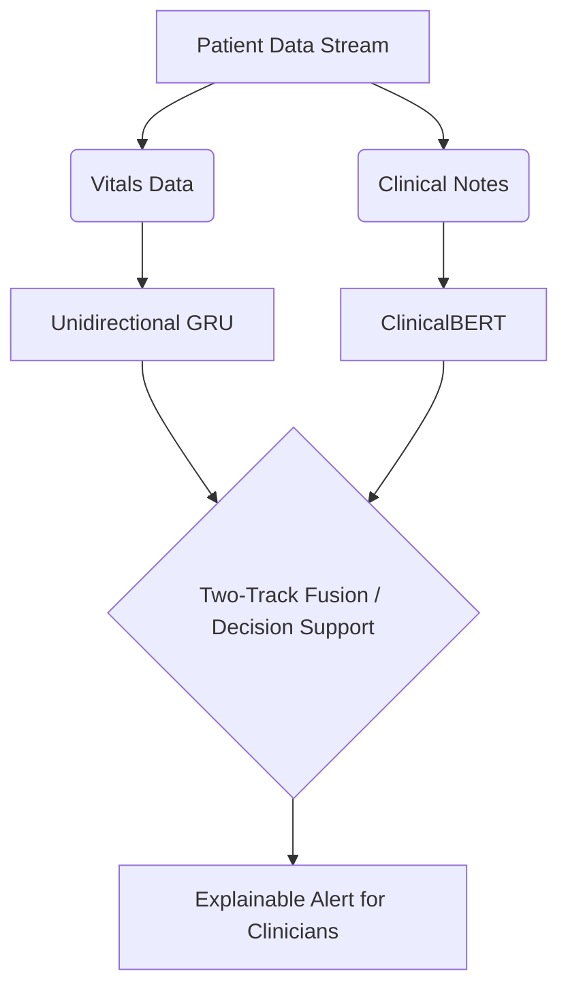
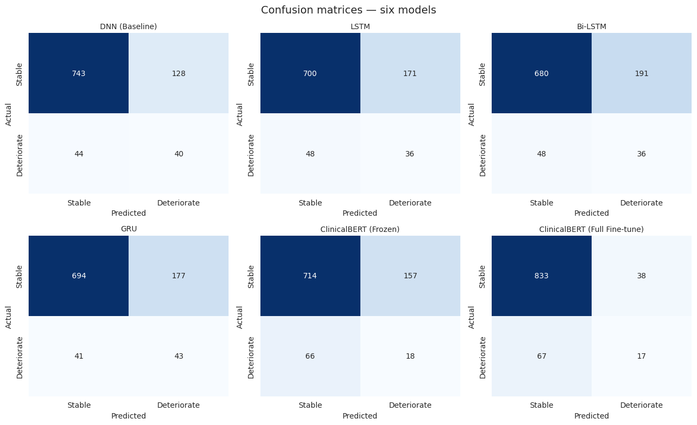

# Building an Intelligent Clinical Early Warning System
## Predicting Patient Deterioration from Vital Signs and Clinical Notes

> [!NOTE]
> **Academic Context:** This assignment was developed as a **Complex Computing Problem** for the **Advanced Deep Learning Course** supervised by **Sir Hamza Farooqi**.
> 
> * **Prepared by:** Muzzamil Khalid
> * **Roll Number:** 22F-BSAI-29
> * **Department:** Artificial Intelligence

---

## Table of Contents
1. [The Clinical Problem](#1-the-clinical-problem)
2. [Baseline Design Decisions](#2-baseline-design-decisions)
3. [Modelling Patient Timelines (RNNs, LSTMs, and GRUs)](#3-modelling-patient-timelines)
4. [Processing Unstructured Clinical Language (Transformers)](#4-the-transformer-and-clinical-language)
5. [Deployment Verdict & Future Multimodal Architecture](#5-deployment-verdict)
6. [Appendix: Unified Model Comparison](#appendix-unified-model-comparison)

---

## 1. The Clinical Problem

Predicting patient deterioration in an Intensive Care Unit (ICU) is significantly more complex than standard classification tasks for several reasons:

1. **Extreme Class Imbalance:** In our cohort of **4,775 patients** (sourced from the *PhysioNet 2019 Sepsis Challenge*), only **8.8%** actually experienced clinical deterioration. A trivial model predicting *"everyone is fine"* would achieve **91.2% accuracy** while failing to catch a single patient in danger.
2. **Highly Sparse & Missing Data (NaNs):** Patient vitals are charted at uneven intervals, labs are drawn sporadically, and most columns in a raw `.psv` file are populated with `NaN` values.
3. **Temporal Trend Dependency:** Diagnosis cannot rely on a single static reading. A heart rate of 110 bpm is not necessarily alarming on its own, but a heart rate that has steadily climbed from 85 to 110 bpm over four hours is a critical warning sign.
4. **Information Locked in Unstructured Notes:** Vital signs alone do not capture the complete clinical picture. Crucial diagnostic cues (e.g., *"patient newly confused"*, *"started vasopressor overnight"*, or *"family reports he is just not himself"*) reside solely in free-text clinical notes.
5. **Asymmetric Error Costs:** A false positive (alerting on a stable patient) incurs minor costs like a few minutes of clinician time or an extra blood draw. A false negative (missing a deteriorating patient) can be fatal. 

### The Solution: Recall-Centric Optimization
To address the asymmetric costs of errors, the loss function was configured with a positive class weight:
$$\text{pos\_weight} \approx 10.4$$
This weight was calculated directly from the class ratio. Throughout evaluation, **Recall** was treated as the primary metric of success.

---

## 2. Baseline Design Decisions

### Vanishing Gradient Mitigation
Deep neural networks are notoriously hard to train due to vanishing gradients during backpropagation. When local derivatives of activation functions (such as Sigmoid or Tanh) are below 1, the gradient decays exponentially as it propagates back to the early layers, halting learning.

To address this, two baseline mechanisms were implemented:
* **ReLU Activation:** Has a derivative of exactly $1.0$ for any positive input, preventing the squashing of gradients.
* **Batch Normalization (BatchNorm):** Re-centers and re-scales the outputs of each layer to stabilize gradient flow, allowing for larger learning rates and smoother training.

### Optimizer Comparison: SGD vs. Adam
We compared Stochastic Gradient Descent (SGD) with momentum (0.9) against Adam ($lr = 1\times10^{-3}$) over 60 epochs.
* **Findings:** Both optimizers converged to a training loss of around $0.60 - 0.65$. However, Adam demonstrated a much smoother optimization trajectory in the early epochs, whereas SGD exhibited significant oscillations. Adam was chosen for the baseline because it required minimal hyperparameter tuning.

*Figure 1: Training loss curves for SGD vs. Adam on the DNN baseline.*

### Terminology Distinction
* **Loss Function:** The error calculated on a single training example (in our case, the weighted binary cross-entropy for one patient).
* **Cost Function:** The aggregate metric minimized by the optimizer, representing the average loss over the whole batch plus regularization penalties.

### Regularization Ablation Study
We conducted an ablation study over four configurations: (1) Both Dropout and BatchNorm, (2) BatchNorm only, (3) Dropout only, and (4) Neither.

* **Key Takeaway:** **Dropout is essential for maintaining Recall in imbalanced settings.** Dropout forces the network to learn redundant representations rather than memorizing the majority class (91% stable patients). Removing Dropout led to a sharp drop in Recall from **0.488** to **0.238**.

*Figure 2: Performance metrics across different regularization configurations.*

---

## 3. Modelling Patient Timelines

Recurrent Neural Networks (RNNs) process sequential patient data but suffer from the vanishing gradient problem over time. Multiplications across long sequences (e.g., 24 hours of hourly vitals) cause gradients to vanish or explode, making vanilla RNNs unable to link distant events.

### LSTMs vs. GRUs
* **LSTMs (Long Short-Term Memory):** Mitigate this issue using a protected cell state with additive updates. Three gates manage information flow:
  1. *Forget Gate:* Discards stale information.
  2. *Input Gate:* Writes new information.
  3. *Output Gate:* Controls what is exposed to the hidden state.
* **GRUs (Gated Recurrent Units):** Merges the cell and hidden states into a leaner design using only two gates (Reset and Update). This reduces parameters and speeds up training.

### Experimental Findings
* **Results:** The unidirectional **GRU achieved the best Recall of 0.512**, outperforming both the LSTM and Bi-LSTM (both at **0.429 Recall**).
* **Training Speed:** The GRU trained faster (3.5s) compared to the LSTM (4.4s).
* **Overfitting:** Training curves showed that all models began overfitting after epoch 15, as validation loss began to rise while training loss steadily declined. This is primarily because 4,775 patients represents a small dataset for temporal models.

*Figure 3: Training vs. validation loss for LSTM, GRU, and Bi-LSTM.*

> [!WARNING]
> **Why Bi-LSTMs leak future information:**
> A Bidirectional LSTM reads sequences in both directions (forward and backward). In a live clinical setting, the future does not exist yet (e.g., vitals at 8:00 AM cannot be used to predict deterioration at 4:00 AM). Using a Bi-LSTM for live monitoring would leak future information during evaluation. Therefore, **unidirectional GRU** is the correct architecture for real-time deployment.

---

## 4. The Transformer and Clinical Language

To leverage clinical notes, we utilized **Transfer Learning** via **ClinicalBERT**—a language model pre-trained on large clinical corpora (PubMed abstracts and de-identified MIMIC-III notes). This pre-training enables the model to understand medical abbreviations, negation (*"no signs of sepsis"*), and clinical terminology (*"febrile"*, *"pyrexia"*).

### Self-Attention
Unlike RNNs that process tokens sequentially, Transformers use self-attention to calculate the relevance of each token to all other tokens in a note, regardless of position. This mirrors a clinician's reading style—focusing immediately on high-risk keywords.

*Figure 4: Final-layer self-attention heatmap. Medical indicators like "febrile" and "tachypneic" receive the highest attention weights.*

### Fine-Tuning Strategy: Frozen vs. Full Fine-Tuning
* **Frozen ClinicalBERT:** Only the classification head is trained. It runs fast (37.8s) but has low capacity, yielding **0.214 Recall**.
* **Full Fine-Tuning:** Backpropagating through all layers improves representations, yielding **0.890 Accuracy** and **0.309 Precision**. However, Recall dropped to **0.202** (catching only 17 of 84 cases).
* **Interpretation:** While full fine-tuning allowed the model to optimize overall accuracy on the majority class (96% recall on stable patients), it struggled on the minority class due to the short, formulaic nature of the synthetic notes.

---

## 5. Deployment Verdict

No single model is ready for autonomous clinical deployment out of the box (the best Recall was **0.512** from the unidirectional GRU). 

For a production environment, we recommend a **two-track system**:
1. **Unidirectional GRU (Vitals Track):** Continuously processes streaming vital signs in real time. It is fast, data-efficient, and does not look into the future.
2. **ClinicalBERT (Notes Track):** Runs on demand whenever a clinician saves a new progress note to capture qualitative risk factors.

### Ethical & Practical Considerations
* **Bias:** Models inherit demographics and treatment biases from the training data. The system must be audited to ensure equal Recall across age, sex, and ethnicity.
* **Privacy:** Clinical notes contain highly sensitive Protected Health Information (PHI). Encryption, de-identification, and access controls are mandatory.
* **Accountability:** The model must act strictly as a decision-support tool. Clinicians retain ultimate clinical responsibility, and every alert must be explainable.

### Multimodal Future
If chest X-rays or imaging were added, the architecture would evolve into a multimodal network:
* Separate encoders for each modality (GRU for vitals, ClinicalBERT for notes, and CNN/Vision Transformer for images).
* A fusion layer (concatenation or cross-attention) combining embeddings into a single vector.
* A shared classification head producing a unified patient risk score.

---

## Appendix: Unified Model Comparison

### Performance Summary
The table below lists the comparative metrics across all six models trained on the PhysioNet dataset (Stratified 80/20 train-test split, 8.8% deterioration rate):

| Model | Accuracy | Precision | Recall | F1-Score | Training Time |
| :--- | :---: | :---: | :---: | :---: | :---: |
| **DNN (Baseline)** | 0.820 | 0.238 | 0.476 | 0.317 | 16.6s |
| **LSTM** | 0.771 | 0.174 | 0.429 | 0.247 | 4.4s |
| **Bi-LSTM** | 0.750 | 0.159 | 0.429 | 0.232 | 4.1s |
| **GRU** | 0.772 | 0.195 | **0.512** | 0.283 | **3.5s** |
| **ClinicalBERT (Frozen)** | 0.766 | 0.103 | 0.214 | 0.139 | 37.8s |
| **ClinicalBERT (Full Fine-tune)** | **0.890** | **0.309** | 0.202 | **0.245** | 152.7s |

### Confusion Matrices

The primary objective of a clinical early warning system is to minimize the **False Negative rate** (the bottom-left cell of each confusion matrix below). Missed deteriorations compromise patient safety. The GRU model successfully minimized false negatives to 41 (out of 84 deteriorating patients).

*Figure 5: Confusion matrices for all six models.*
